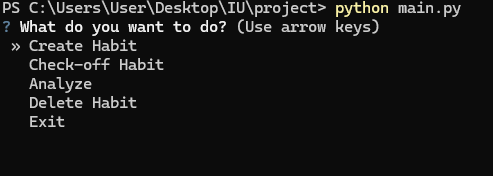
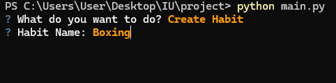
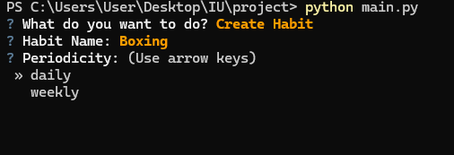
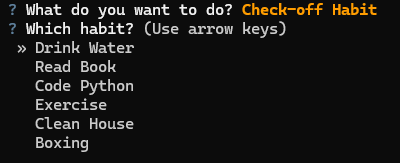
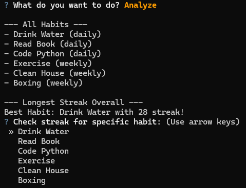
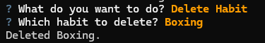

# HabitTracker CLI

A distraction-free, terminal-based habit tracking application written in
Python.

## Overview

HabitTracker CLI helps you build consistency by allowing you to track
your daily and weekly habits without the clutter of complex graphical
interfaces. It features a robust analytics module to calculate streaks
and visualize your progress over time.

Upon first launch, the application comes pre-loaded with **5 sample
habits** and **4 weeks of historical data**, allowing you to explore the
analytics features immediately.

## Key Features

-   **Flexible Tracking:** Support for both **Daily** and **Weekly**
    habits.
-   **Streak Analytics:** Automatically calculates current streaks based
    on your completion history.
-   **Data Persistence:** Your progress is saved automatically to a
    local JSON file (`data.json`), ensuring no data is lost between
    sessions.
-   **Functional Analytics:** Uses pure functions to analyze your data
    without side effects.
-   **Interactive CLI:** Navigate easily using arrow keys (powered by
    the `questionary` library).

## Prerequisites

-   Python 3.7 or higher
-   `pip` (Python package installer)

## Installation

1.  **Clone or Download** this repository to your local machine.
2.  Open your terminal or command prompt and navigate to the project
    folder.
3.  **Install the required dependencies** by running:

``` bash
pip install -r requirements.txt
```

*(Note: If `requirements.txt` is missing, you can install the
dependencies manually using the command below)*

``` bash
pip install questionary pytest
```

## Usage & Visual Guide

To start the application, run the `main.py` file from your terminal:

``` bash
python main.py
```

------------------------------------------------------------------------

## Application Walkthrough

### Main Menu

When you start the application, you will be greeted with the main menu.



Use the **arrow keys** to navigate and press **Enter** to select.

------------------------------------------------------------------------

### Creating a Habit

Select **Create Habit** from the main menu and enter the name of the
habit.



------------------------------------------------------------------------

### Selecting Habit Periodicity

Choose how often the habit should be completed:

-   **Daily**
-   **Weekly**



------------------------------------------------------------------------

### Habit Created Confirmation

Once the habit is successfully created, the application displays a
confirmation message.


------------------------------------------------------------------------

### Checking Off a Habit

To mark a habit as completed, select **Check Off Habit**.



This records the completion date and updates the streak.

------------------------------------------------------------------------

### Viewing Habit Analytics

Select **Analyze Habits** from the main menu to view analytics such as:

-   Current streaks
-   Completion history
-   Habit performance over time



------------------------------------------------------------------------

### Deleting a Habit

Select **Delete Habit** and choose the habit to remove.



⚠️ **Warning:** This permanently removes the habit and its history from
`data.json`.

------------------------------------------------------------------------

## Data Storage

All habit data is stored locally in:

    data.json

The file stores:

-   Habit names
-   Habit periodicity
-   Completion history
-   Streak calculations

------------------------------------------------------------------------

## Running Tests

To run the test suite:

``` bash
pytest
```

------------------------------------------------------------------------

## Project Structure

    HabitTracker/
    │
    ├── main.py
    ├── habits.py
    ├── analytics.py
    ├── storage.py
    ├── data.json
    ├── requirements.txt
    │
    ├── screenshots/
    │   ├── main_menu.png
    │   ├── create_habit.png
    │   ├── create_habit_period_selection.png
    │   ├── habit-created_confirmation.png
    │   ├── habit_checkoff.png
    │   ├── analyze_menu.png
    │   └── delete_habit.png
    │
    └── tests/

------------------------------------------------------------------------

## Future Improvements

Potential future features:

-   CSV export for analytics
-   Visual charts for streaks
-   Notifications and reminders
-   Cloud synchronization
-   Habit tagging and categories

------------------------------------------------------------------------

## License

This project is open-source and available under the MIT License.
